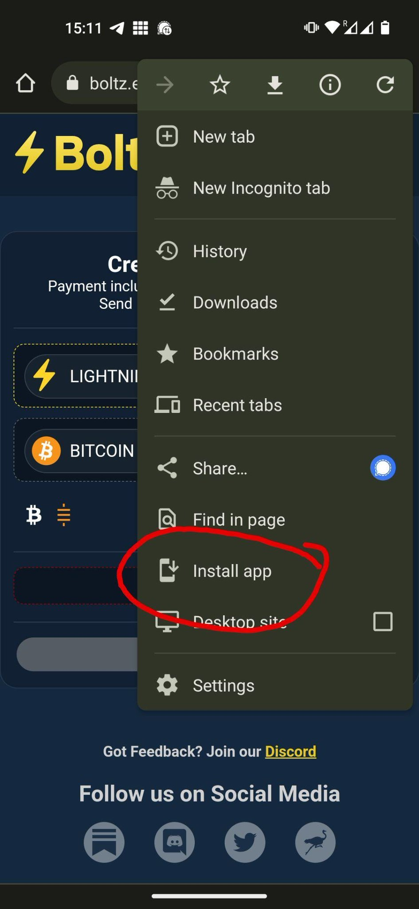
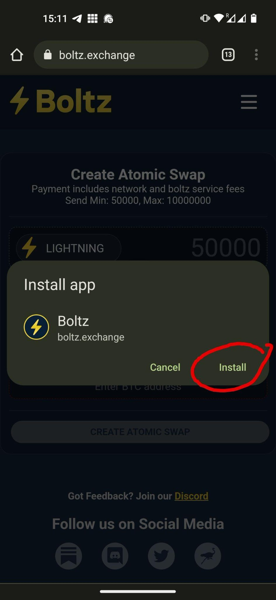
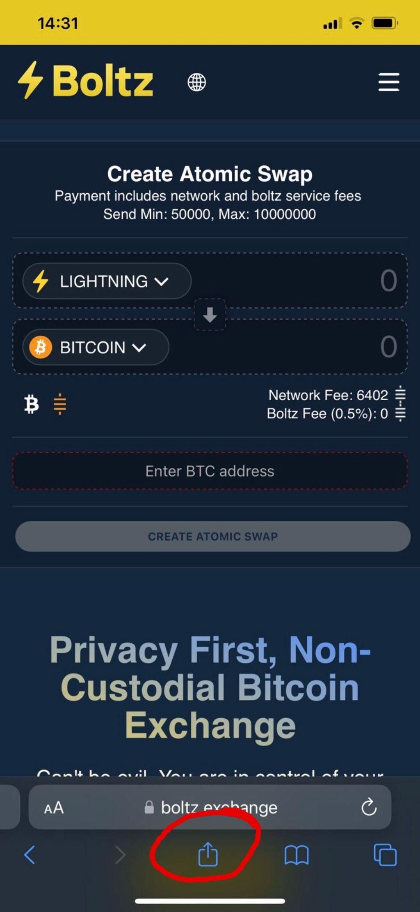
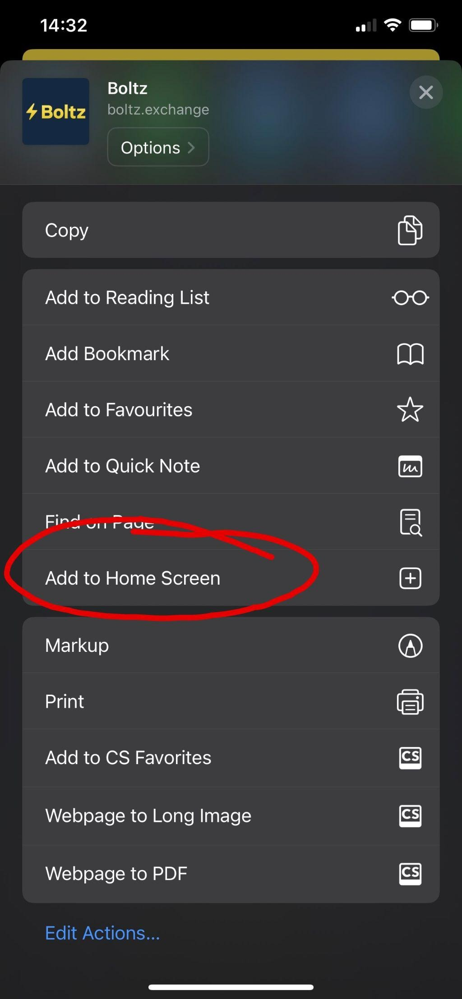
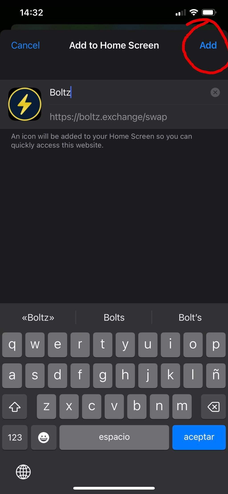
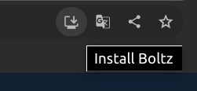
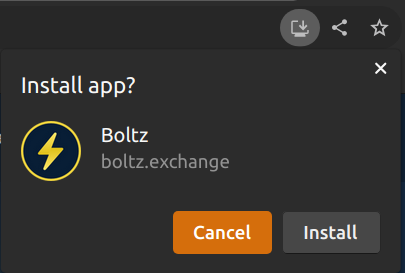
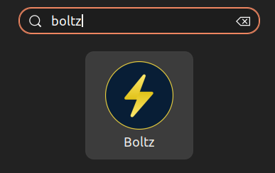

# 📲 Install as App

For improved censorship resistance and privacy, Boltz is not available in app
stores, but can be installed as Progressive Web App (PWA) on all Android and iOS
devices, as well as desktop computers.

## Android

1. Open [boltz.exchange](https://boltz.exchange) in a mobile browser like
   [Chrome](https://www.google.com/chrome/) or
   [Vanadium](https://github.com/GrapheneOS/Vanadium), open the browser menu and
   tap "Install app":

<figure><figcaption></figcaption></figure>

2. Confirm with "Install":

<figure><figcaption></figcaption></figure>

3. Now you find Boltz as App Icon on your home screen which you can use just
   like any other app.

## iOS

1. Open [boltz.exchange](https://boltz.exchange) in your Safari mobile browser
   and tap the share button:

<figure><figcaption></figcaption></figure>

2. Tap "Add to Home Screen":

<figure><figcaption></figcaption></figure>

3. Confirm by tapping "Add":

<figure><figcaption></figcaption></figure>

4. Now you find Boltz as App Icon on your home screen which you can use just
   like any other app.

## Desktop

Here an example how to install Boltz as App on a Ubuntu Desktop Computer using
[Chromium](https://www.chromium.org/Home/):

1. Open [boltz.exchange](https://boltz.exchange) and click the install icon that
   automatically appears:

<figure><figcaption></figcaption></figure>

2. Confirm by clicking "Install":

<figure><figcaption></figcaption></figure>

3. Now you find Boltz as App Icon in your application collection:

<figure><figcaption></figcaption></figure>
